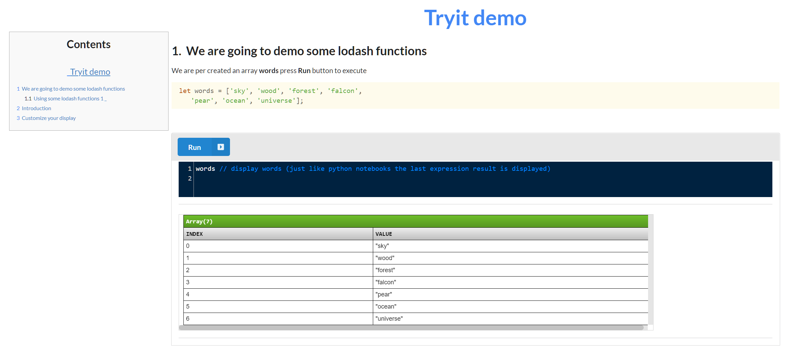

# 

CLI (command line) application to generate HTML file to write tutorials for Javascript librarries. The HTML tutorial file (a try file) that
requires no backend server, and totally self contained. This containing editable Javascript code snippets that can be edited and executed in the browser. This is designed to help npm module developers to publish pages to that other developers can try out ther library with the minimum of effort.

<a href="https://raw.githubusercontent.com/nurulc/tryitjs/master/try_it/index.html">TryITjs Tutorial</a><br />
<a href="https://raw.githubusercontent.com/nurulc/tryitjs/master/try_it/full-tutorial.html">Overview of TryitJS</a><br />
<a href="https://nurulc.github.io/frame/tryit/data-frame-examples.html">A more extensive example</a><br />

## Instalation

### Install globally 
```sh
npm install -g  tryitjs
```
### Quickly try it out

* Start a command prompt (bash on Linux, cmd on Windows,...)
* Navigate to an empty directory (or you outer level projects directory)
```sh
tryitjs --init my-try-playpen
```
You will see that a new directory has been created __my-try-playpen__

Switch to the the playpen directory as follows:
```sh
cd my-try-playpen
npm install
npm run build
npm start
```

### Simplest usage

The processor takes as input a file with the extension _&lt;filename&gt;.try_ and generates _&lt;filename&gt;.html_ 


further is creates two extra directories (in --local mode):

* stylesheets
* javascript


The init action will do several things:
1. By default all javascripts and css are pulled from the internat
1. In --local mode, create, if it does not already exist, the following
   * _&lt;target dir&gt;_:/javascripts   _directory_
   * _&lt;target dir&gt;_:/javascript/tryit.js _core tryit helper script_
   * _lt;target dir&gt;_:/javascript/prettyprint.js _display utility_
   * _&lt;target dir&gt;_:/stylesheet/tryit.css _core stylesheet_
   


* Optional create .tryit.json 
	* this is done with the option `tyritjs --init`
```javascript 
{
 "headers": {
    "css": ["https://...", ...],
    "scripts": ["https://...js",...] 
  },
  "local": {
    "css": [
        "/stylesheets/tryit.css"
    ],
    "scripts": [
    "/javascript/prettyprint.js", 
    "/javascript/tryit.js"
    ]
  },
   "onend": ` <!-- HTML to ADD at the bottom of the html file, just before </body> -->
          <script
          src="https://code.jquery.com/jquery-3.1.1.min.js"
          integrity="sha256-hVVnYaiADRTO2PzUGmuLJr8BLUSjGIZsDYGmIJLv2b8="
          crossorigin="anonymous"></script>
        <script src="https://cdnjs.cloudflare.com/ajax/libs/semantic-ui/2.4.1/semantic.min.js"></script>
        <script>
          $('.activating.element').popup({inline: true, });
        </script>
  `
}
``` 

#### Example of HTML generated

The following command can be used to generate a __.HTML__ file from a __.try__ file 
```bash
 > tryitjs index.try
```
<a href="https://github.com/nurulc/tryitjs/blob/master/try_src/index.try">Sample .try file</a>

The command above generates and <a href="index.html">index.html</a>


### What is a .try file

Very it is a markdown file with a few simple extensions, .try file have the following few commands:

### Multi-line markup
|  command 	|   Sescription	|
|---	|---	|
|**!head**  	|   Items to be added to the _&lt;head&gt;_ add all subsequent lines become part of html/head	until the next command|
|**!md**  	|   Subsequent lines are treated as markdown	|
|**!tryit** |  the subsequent lines are editable and executable javascript	|
|**!html**  |  the subsequent lines are plain html fragments	|

```
!head
  <link <link rel="stylesheet" href="https://cdn.jsdelivr.net/gh/highlightjs/cdn-release@10.2.0/build/styles/default.min.css" />
  <script src="javascript/tryit.js"></script>
!md   -- end the !head and starts markdown segment
# This is a title

...

!tryit -- start some javascript  
  let arr = [1, 2, 3]; 
  x
```
### Single line markup

Does not end the previously started command section, in these single-line command can be a part oone of the previous command

|  command 	|   Sescription	|
|---	|---	|
| @@include &lt;file name&gt; | copy the contents of the file into the current location |
| **!--**  |  the rest of the line is a comment 	|

### Run from command prompt

* locally installed
> node_modules/.bin/tryitjs <input-file> {-d target-directory} {-src source-dir}

* Globally installed

> tryitjs <input-file> {--dest target-directory}
* or more generally 
	
> tryitjs --src <src dir for .try files> --dest <target dir for generated .html files> { --local }
	

