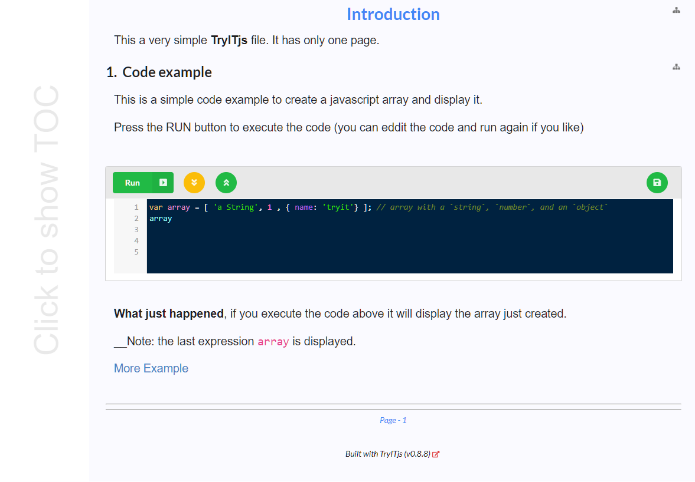

# 

CLI (command line) application to generate HTML file to write tutorials for Javascript librarries. The HTML tutorial file (a try file) that
requires no backend server, and totally self contained. This containing editable Javascript code snippets that can be edited and executed in the browser. This is designed to help npm module developers to publish pages to that other developers can try out ther library with the minimum of effort.

* <a href="https://unpkg.com/tryitjs/try_it/index.html">TryITjs Tutorial</a><br />
* <a href="https://unpkg.com/tryitjs/try_it/full-tutorial.html">Overview of TryitJS</a><br />
* <a href="https://nurulc.github.io/frame/tryit/data-frame-examples.html">A more extensive example on how to create a Tutorial</a><br />

## Development status

The code is in fairly good shape and is ready for developers to use. The documentation is still work in progress, but this site as some good example for you to use.

### Why TryTTjs

A with most development it was to meet a need that i had, namely to delevop an interactive tutorial for a DataTable loosly base of Python's Pandas library for Javascript. 
[DataFrame](https://github.com/nurulc/data-frame). The tool is powerful but it is hard to know what you can do with it. The tutor in written in and mostly markdown similar to this document. Interspesed with the markdown ther is runnable javascript code. That can be executed and edited to get hands on experiece with the ideas and api.

Any number of utilities and libraries can be included with the tutorial. Besides markdown, sections can how the full power of HTML as well as Javascript. I have found it easier to write a tutorial if ther is a step by step guide working through a real problem. TryITjs creates an standalone HTML page with no backend server required (except to deliver the page).

> Work in progrress


## Instalation

### Install globally 
```sh
npm install -g  tryitjs
```
### Quickly try it out

* Start a command prompt (bash on Linux, cmd on Windows,...)
* Navigate to an empty directory (or you outer level projects directory)
```sh
tryitjs --init my-try-playpen
```
You will see that a new directory has been created __my-try-playpen__

Switch to the the playpen directory as follows:
```sh
cd my-try-playpen
npm install
npm run build
npm start
```

### Simplest usage


#### Example of HTML generated

The following command can be used to generate a __.HTML__ file from a __.try__ file 
```bash
 > tryitjs basic.try
```
<a href="https://github.com/nurulc/tryitjs/blob/master/try_src/basic.try">Sample .try file</a>

The command above generates and 
<a href="https://unpkg.com/tryitjs/try_it/basic.html">basic.html (click to see live results)</a>
<br><br>



### What is a .try file

Very it is a markdown file with a few simple extensions, .try file have the following few commands:

### Multi-line markup
|  command 	|   Sescription	|
|---	|---	|
|**!head**  	|   Items to be added to the _&lt;head&gt;_ add all subsequent lines become part of html/head	until the next command|
|**!md**  	|   Subsequent lines are treated as markdown	|
|**!tryit** |  the subsequent lines are editable and executable javascript	|
|**!html**  |  the subsequent lines are plain html fragments	|

```
!head
  <link <link rel="stylesheet" href="https://cdn.jsdelivr.net/gh/highlightjs/cdn-release@10.2.0/build/styles/default.min.css" />
  <script src="javascript/tryit.js"></script>
!md   -- end the !head and starts markdown segment
# This is a title

...

!tryit -- start some javascript  
  let arr = [1, 2, 3]; 
  x
```
### Single line markup

Does not end the previously started command section, in these single-line command can be a part oone of the previous command

|  command 	|   Sescription	|
|---	|---	|
| @@include &lt;file name&gt; | copy the contents of the file into the current location |
| **!--**  |  the rest of the line is a comment 	|

### Run from command prompt

* locally installed
> node_modules/.bin/tryitjs <input-file> {-d target-directory} {-src source-dir}

* Globally installed

> tryitjs <input-file> {--dest target-directory}
* or more generally 
	
> tryitjs --src <src dir for .try files> --dest <target dir for generated .html files> { --local }
	

