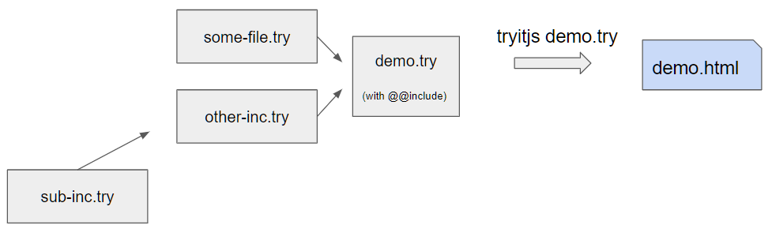

# TryITJs Project Types

The command __tryitjs__ is used to convert a _.try_ file into a _.html_ file. The HTML file generated will require only a simple server that can deliver the HTML to the browse - no other back-end support is required. This section will show you how to support various project structure:

For illustration purpose we will assume that the generated file will be called __demo.html__, so at the very least you will require a __demo.try__ file for your project.

[Command line options](command-line-options.md)

## Super Simple Project

The simplest tryit project consists of a single file e.g.  [__demo.try__](demo/demo.try) this consists of just a single file with no dependency on any other __.try__ file. You can include scriptsnfrom the web and other resources from the web (.css, .jpg ...) but no other files from your project directory.

**Command** ```tryitjs demo.try```

 

The command will create [__demo.html__](demo/demo.html) in the current directory.

#### Notes on .try files

All top level ```.try``` file (and only the top level file) are used to generate a corresponding ```.html``` file. You can have more than one top level file and for each one a correspnding `.html` file can be created. You can have other ```.try``` file consisting of fragments of code and markdown to be incorporated into one or more of these top level files. The first line of a top level file must start with

```!head``` on its own. This called the __head__ section, lines after this section are added to the ```<head>``` section of the output HTML file. Note there can be more that one ```!head``` section in a ```.try``` file. All the head sections are collected and added to the ```<head>``` section of the genearted HTML. All ```try``` start with ```!``` and all subsequent lines belong to the section until the next section market is found. Section markers must be at the begining of a line (no indentation is allowed).  

## Simple Project

If you are creating a mor elaborate example the corresponding __.try__ file can get big and un unwieldy. So lets see how to break up the project into modular components. Use the ```@@include some-file.try``` to paste the contents of __some-file.try__ into the the location. The ```@@include ...``` is recursive, namely the ```some-file.try``` itself can contain _@@include_ commands. This mechanism is used to modularize __.try__ files. You can have as many _@@include_ in your _.try_ file 
as needed.

The format of a top level __.try__ file is as follows:

```
!head
  <title>My Demo</title>
  <sone html header content scripts, .css, fonts>
  ...
!md -- some markdown
  <some markdown content>
  
@@include some-file.try

...
@@include other-inc.try
...

```
**Command** ```tryitjs demo.try```

  
 
 [More details on ```@@include``` can be found here](include.md)
 
 ## Suggested project structure
 
 
