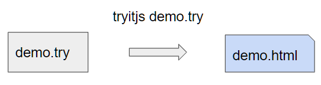

# TryITJs Project

## Super simple

The simplest tryit project consists of a single file e.g. __demo.try__ this consists of just a single file with no dependency on any other .try file. You can include scripts 
form the web and other resources from the web (.css, .jpg ...) but no other files from your project directory.

